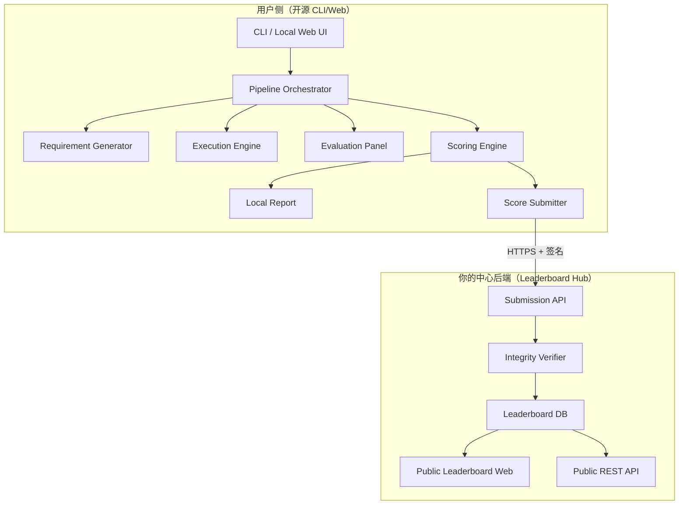
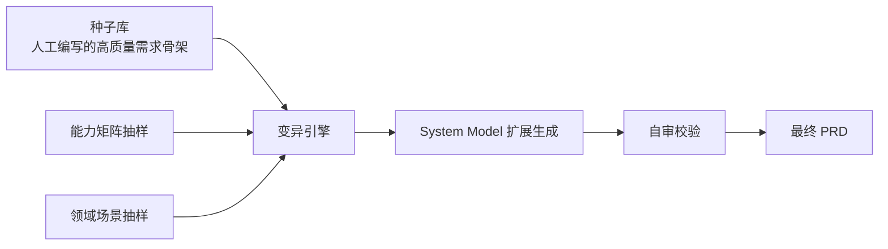
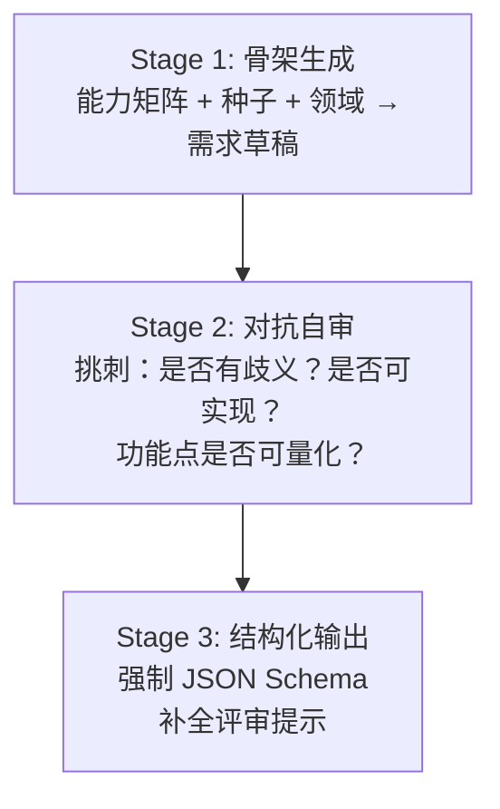
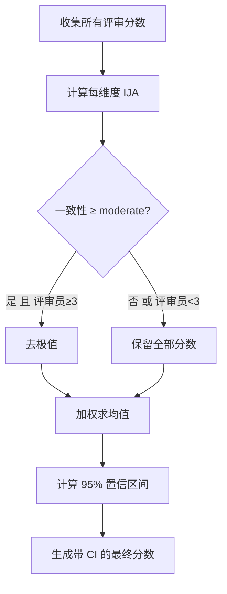
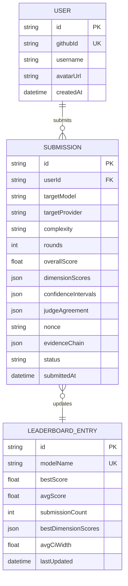
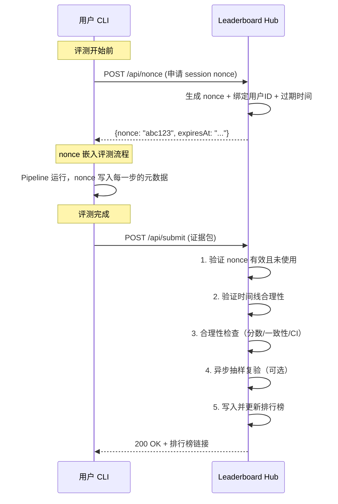
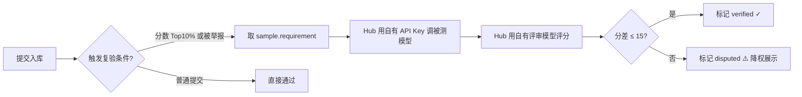

# Req-2-Rank：AI 编码能力评测系统 — 完整构思方案 v2

## 一、系统定位与核心价值

**一句话定义**：Req-2-Rank 是一个**开源的** AI 编码能力评测框架。用户自行部署评测流水线，结果可上传至中心排行榜，形成社区驱动的 LLM 编码能力基准。

**核心差异化**：
1. **动态题库** — 每次运行生成全新需求，杜绝数据泄漏
2. **多模型陪审团** — LLM-as-a-Judge 交叉评审，去偏见
3. **开源自部署** — 用户用自己的 API Key，在本地/服务器跑评测
4. **社区排行榜** — 分数可提交到中心后端，公开可查，形成生态

---

## 二、整体架构（开源 + 中心化）



系统分为两大部分：

| 部分 | 归属 | 部署 | 职责 |
|------|------|------|------|
| **评测引擎** (CLI/Web) | 开源仓库 | 用户自行部署 | 出题、执行、评审、计分 |
| **排行榜中枢** (Hub) | 你维护 | 你的服务器 | 接收分数、验证、排行、展示 |

---

## 三、技术选型

### 评测引擎（开源端）

| 层次 | 选型 | 理由 |
|------|------|------|
| **语言** | TypeScript (Node.js) | 类型安全、生态丰富、异步 IO |
| **CLI** | Commander.js | 主要入口，零依赖部署 |
| **本地存储** | SQLite (better-sqlite3) | 单文件数据库，无需外部服务 |
| **ORM** | Drizzle ORM | 轻量、类型安全 |
| **LLM 适配** | 自建 Provider Adapter | 统一多厂商接口 |
| **配置校验** | Zod | 运行时类型校验 |
| **本地 Web UI** | Vite + React（可选） | 第二阶段，提供可视化报告 |

### 排行榜中枢（你的服务器）

| 层次 | 选型 | 理由 |
|------|------|------|
| **框架** | Next.js (App Router) | SSR 排行榜页面 + API Routes |
| **数据库** | PostgreSQL + Drizzle | 生产级存储 |
| **部署** | Vercel / Railway | 免运维，易扩展 |
| **认证** | GitHub OAuth | 提交分数需关联身份 |

---

## 四、核心模块详细设计

### 4.1 Provider Adapter Layer（多厂商 API 适配层）

```typescript
interface LLMProvider {
  id: string;                    // "openai", "anthropic", "google"
  name: string;
  chat(params: ChatParams): Promise<ChatResponse>;
}

interface ChatParams {
  model: string;
  messages: Message[];
  temperature?: number;
  maxTokens?: number;
  responseFormat?: "text" | "json";
}

interface ChatResponse {
  content: string;
  usage: { promptTokens: number; completionTokens: number };
  latencyMs: number;
}
```

**支持的厂商**：OpenAI / Anthropic / Google / 任意 OpenAI-Compatible API（Ollama、vLLM 等）

---

### 4.2 Requirement Generator（需求生成引擎）🧠

这不是一个简单的 Prompt 模板，而是一套**多维度、组合式、自校准**的动态出题引擎。

#### 设计哲学

固定题库的致命缺陷：
1. 模型训练数据可能已包含题目 → 分数虚高
2. 同一难度的题目实际难度差异巨大 → 结果不稳定
3. 单一维度分级（代码量）太粗糙 → 无法精准区分能力

解决方案：**能力矩阵 × 领域场景 × 种子变异 × 三阶段生成 × 自适应校准**

---

#### 4.2.1 能力矩阵（Skill Matrix）

不再用单一的 L1-L5 线性分级，改为**二维矩阵**：能力标签 × 复杂度等级。

**能力标签（Skills）** — 被测模型需要展现的核心能力：

| 能力标签 | 说明 | 示例考点 |
|---------|------|---------|
| `algorithm` | 算法设计与数据结构 | 排序、搜索、图遍历、DP |
| `api-design` | RESTful / GraphQL 接口设计 | 路由设计、请求/响应格式 |
| `data-processing` | 数据清洗、转换、聚合 | CSV 解析、JSON 变换、管道处理 |
| `error-handling` | 异常处理与边界条件 | 输入校验、优雅降级、重试机制 |
| `concurrency` | 并发与异步编程 | Promise 编排、竞态处理、限流 |
| `security` | 安全编码实践 | 输入消毒、认证鉴权、加密 |
| `testing` | 测试编写能力 | 单元测试、Mock、边界用例 |
| `system-design` | 架构与模块划分 | 分层、依赖注入、接口抽象 |
| `frontend` | UI 构建能力 | 组件设计、状态管理、响应式 |
| `database` | 数据建模与查询 | Schema 设计、SQL/ORM、索引 |

**复杂度等级 (Complexity)** — 正交于能力标签：

| 等级 | 代号 | 定义 | 约束条件 |
|------|------|------|---------|
| C1 | `atomic` | 单一功能点、清晰输入输出 | 1 个文件、1 个函数 |
| C2 | `composed` | 2-3 个功能点组合 | 1-2 个文件 |
| C3 | `integrated` | 多功能协作，需要设计决策 | 多文件、明确模块边界 |
| C4 | `architectural` | 完整应用架构 | 前后端分离或多层架构 |

**出题时随机从矩阵中选取**: `{skills: ["api-design", "error-handling"], complexity: "C2"}`

这意味着同一个 C2 难度，可能是"设计一个带错误处理的 REST API"，也可能是"写一个带重试的并发数据管道"，**极大地扩展了题目空间**。

---

#### 4.2.2 领域-场景分类法（Domain Taxonomy）

能力矩阵决定"考什么"，领域场景决定"在什么背景下考"。

```typescript
const DOMAIN_TAXONOMY = {
  // 领域 → 场景列表
  "电商": ["商品搜索", "购物车", "优惠券计算", "库存管理", "订单状态机"],
  "社交": ["Feed流", "评论系统", "通知推送", "好友关系", "内容审核"],
  "金融": ["交易记账", "汇率转换", "风控规则", "报表生成", "对账系统"],
  "开发工具": ["CLI 工具", "配置解析器", "日志分析", "代码格式化", "Mock Server"],
  "数据分析": ["数据清洗", "统计聚合", "可视化数据准备", "日志解析", "ETL管道"],
  "IoT/嵌入式": ["传感器数据采集", "协议解析", "告警规则引擎", "设备状态管理"],
  "游戏": ["游戏循环", "碰撞检测", "记分板", "存档系统", "关卡生成"],
  "通用工具": ["文件格式转换", "正则引擎", "缓存系统", "任务调度", "Markdown渲染"],
} as const;
```

出题时随机组合：`能力[api-design × error-handling] + 领域[电商/订单状态机] + 复杂度[C2]`
→ 生成："设计一个电商订单状态机 REST API，支持状态流转和异常订单处理"

---

#### 4.2.3 种子-变异机制（Seed & Mutation）

为了让每次生成的题目既有**基本质量保证**又有**足够随机性**，采用"种子 + 变异"策略：



**种子库**（内置 ~50 个，社区可贡献）：

```typescript
interface RequirementSeed {
  id: string;
  template: string;           // "Build a {domain_object} {action} with {constraint}"
  skills: string[];            // 适用的能力标签
  complexity: "C1" | "C2" | "C3" | "C4";
  slots: Record<string, string[]>;  // 可填充的变量槽
}

// 示例种子
const seed_example: RequirementSeed = {
  id: "seed-rest-crud",
  template: "Build a REST API for managing {entity} with {features}",
  skills: ["api-design", "database", "error-handling"],
  complexity: "C3",
  slots: {
    entity: ["blog posts", "inventory items", "user profiles", "support tickets"],
    features: [
      "pagination and filtering",
      "role-based access control",
      "soft delete and audit trail",
      "bulk operations and validation",
    ],
  },
};
```

**变异操作**：
- **槽位填充**：从 `slots` 随机选取 + 领域场景注入
- **约束叠加**：随机添加额外约束（"不使用任何 ORM"、"必须包含单元测试"、"限制在 100 行内"）
- **组合升级**：将两个 C1 种子组合成一个 C2 题目
- **领域迁移**：同一种子骨架放到不同领域（"博客系统" → "设备管理系统"）

---

#### 4.2.4 三阶段 Prompt Pipeline



**Stage 1 — 骨架生成 Prompt** (示意):

```markdown
你是一位软件项目经理。根据以下输入生成一份完整的项目需求文档。

## 输入参数
- 考察能力: {skills}
- 复杂度: {complexity} ({complexity_description})
- 领域: {domain} / 场景: {scenario}
- 种子模板: {seed_template} (如有)
- 技术栈: {tech_stack}
- 附加约束: {extra_constraints}

## 生成要求
1. 需求必须有具体、可验证的功能点（不得出现"用户体验良好"等模糊表述）
2. 每个功能点必须是独立可评分的
3. 必须包含至少一个边界条件或异常场景
4. 难度应匹配复杂度等级，不多不少
5. 给出具体的输入/输出示例
```

**Stage 2 — 对抗自审 Prompt**:

```markdown
你是一位 QA 工程师。审查以下需求文档，找出所有问题：

{draft_requirement}

逐条检查：
1. 是否存在歧义表述？（同一句话是否有多种理解方式）
2. 功能点是否可量化验证？（能否写出明确的 pass/fail 标准）
3. 技术上是否可实现？（不超出给定技术栈的能力范围）
4. 难度是否与 {complexity} 等级匹配？
5. 是否有冲突的约束条件？

输出修改后的完整需求文档，附带修改说明。
```

**Stage 3** 将自审修改后的文档转换为结构化 JSON。

---

#### 4.2.5 PRD 数据结构

```typescript
interface ProjectRequirement {
  // 标识
  id: string;
  version: string;                 // "1.0" — 同一需求自审后可能修订

  // 需求内容
  title: string;
  description: string;             // 详细的自然语言描述
  functionalRequirements: Array<{
    id: string;                    // "FR-1", "FR-2"
    description: string;
    acceptanceCriteria: string;    // 明确的通过/失败标准
    priority: "must" | "should" | "nice-to-have";
  }>;
  constraints: string[];
  expectedDeliverables: string[];
  exampleIO?: Array<{             // 输入/输出示例
    input: string;
    expectedOutput: string;
  }>;

  // 元信息（用于评审和统计）
  metadata: {
    skills: string[];              // 考察的能力标签
    complexity: "C1" | "C2" | "C3" | "C4";
    domain: string;
    scenario: string;
    techStack: string[];
    seedId?: string;               // 使用的种子 ID
    mutationLog: string[];         // 变异操作日志
  };

  // 评审辅助
  evaluationGuidance: {
    keyDifferentiators: string[];   // "区分优秀与及格的关键点"
    commonPitfalls: string[];       // "常见的错误实现方式"
    edgeCases: string[];            // "必须覆盖的边界条件"
  };

  // 生成信息
  generatedBy: string;
  generatedAt: string;
  selfReviewPassed: boolean;        // Stage 2 是否通过
}
```

---

#### 4.2.6 难度校准（Adaptive Calibration）

随着评测数据积累，系统可以回过头来校准题目难度：

```
历史数据: "skills=[algorithm, concurrency], C3" 的平均得分 = 45/100
         "skills=[api-design], C3" 的平均得分 = 78/100
→ [algorithm+concurrency, C3] 实际偏难，校准为 C3.5
→ [api-design, C3] 实际偏易，校准为 C2.5
```

这是 Phase 3 的高级特性，但数据结构从一开始就需要支持（`metadata.skills` + 最终得分关联）。

---

### 4.3 Execution Engine（开发执行引擎）

- 将 PRD 发给被测模型，强制 JSON 格式输出代码文件
- **容错**：JSON 解析失败时降级为正则提取代码块
- **超时映射**（统一使用 C1-C4）：

| 复杂度 | 超时 | 最大 Token | 说明 |
|--------|------|-----------|------|
| C1 `atomic` | 30s | 4K | 单函数，快速返回 |
| C2 `composed` | 60s | 8K | 2-3 个功能点 |
| C3 `integrated` | 120s | 16K | 多文件模块 |
| C4 `architectural` | 180s | 32K | 完整应用架构 |

---

### 4.4 Evaluation Panel（评审团模块）

#### 评分维度

| 维度 | 权重 | 说明 |
|------|------|------|
| **功能完整性** | 30% | 是否实现所有功能点 |
| **代码质量** | 25% | 命名、结构、可读性 |
| **逻辑准确性** | 25% | 算法正确、边界处理 |
| **安全性** | 10% | 注入漏洞、硬编码秘钥 |
| **工程实践** | 10% | 错误处理、文档、测试 |

每个评审模型独立打分，不共享其他模型结果。

#### 一致性与置信区间指标

单纯取加权平均无法反映评审结果是否可靠。系统为每次评审计算以下元指标：

**1. Inter-Judge Agreement (IJA) — 评审员一致性**

衡量评审员之间的共识程度，使用 **Krippendorff's alpha** 或简化版 **标准差归一化**：

```typescript
interface JudgeAgreement {
  // 每个维度的一致性
  perDimension: Record<string, {
    mean: number;           // 各评审均值
    stdDev: number;         // 标准差
    range: number;          // 最高分 - 最低分
    agreementLevel: "high" | "moderate" | "low";  // 基于阈值判定
  }>;
  // 总体一致性
  overall: {
    avgStdDev: number;      // 所有维度标准差的均值
    agreementLevel: "high" | "moderate" | "low";
  };
}

// 一致性阈值
// stdDev ≤ 8  → "high"    (评审员基本一致)
// stdDev ≤ 15 → "moderate" (存在分歧但可接受)
// stdDev > 15 → "low"     (严重分歧，需标记预警)
```

**2. Confidence Interval (CI) — 置信区间**

基于评审员打分的分布，给出综合得分的 95% 置信区间：

```typescript
interface ScoreWithConfidence {
  score: number;            // 加权均值 (如 84.2)
  ci95: [number, number];   // 95% 置信区间 (如 [79.1, 89.3])
  reliability: "definitive" | "indicative" | "unreliable";
}

// 对于 N 个评审员，CI = mean ± t(0.025, N-1) × (stdDev / √N)
// reliability 判定：
//   CI 宽度 ≤ 10 → "definitive"   (结果可靠)
//   CI 宽度 ≤ 20 → "indicative"   (仅供参考)
//   CI 宽度 >  20 → "unreliable"  (分歧过大，建议增加评审员)
```

**3. 分歧标记与处理**

当某个维度出现 `agreementLevel: "low"` 时：
- 报告中醒目标记 ⚠️ 并展示各评审员的原始分数
- 不做去极值处理（分歧大时去极值反而丢失信息）
- 提交到排行榜时该维度附带置信区间，排行榜 UI 显示误差线

---

### 4.5 Scoring Engine（评分引擎）

#### 计算流程



加权公式：`维度得分 = Σ(分数ᵢ × 权重ᵢ) / Σ(权重ᵢ)`
综合得分 = 各维度加权求和

#### 输出结构

```typescript
interface ScoringResult {
  overall: ScoreWithConfidence;          // 综合分 + CI
  dimensions: Record<string, ScoreWithConfidence>; // 各维度 + CI
  agreement: JudgeAgreement;            // 一致性分析
  warnings: string[];                    // 如 "security 维度评审一致性低 (σ=18.5)"
}
```

---

## 五、开源项目架构设计 ⭐

### 5.1 发布形态

```
npm install -g req2rank     ← 全局命令行工具
npx req2rank run             ← 免安装直接跑
```

**发布为 npm 包**，用户只需 Node.js 18+ 环境即可运行。

### 5.2 零依赖外部服务

开源端的设计原则：**除了 LLM API 之外不依赖任何外部服务**。

- 数据库用 SQLite（嵌入式，零配置）
- 不需要 Redis、不需要 Docker
- 配置文件一个 `req2rank.config.json` 搞定

### 5.3 配置设计

```jsonc
// req2rank.config.json
{
  // 被测模型
  "target": {
    "provider": "openai",
    "model": "gpt-4o-mini",
    "apiKey": "sk-xxx",           // 或环境变量 $R2R_TARGET_API_KEY
    "baseUrl": null               // 自定义 API 地址（Ollama 等）
  },

  // 系统模型（生成需求）
  "systemModel": {
    "provider": "anthropic",
    "model": "claude-sonnet-4-20250514",
    "apiKey": "sk-ant-xxx"
  },

  // 评审团
  "judges": [
    { "provider": "openai",    "model": "gpt-4o",           "apiKey": "sk-xxx", "weight": 1.0 },
    { "provider": "anthropic", "model": "claude-sonnet-4-20250514", "apiKey": "sk-ant-xxx", "weight": 1.2 },
    { "provider": "google",   "model": "gemini-1.5-pro",   "apiKey": "AIza-xxx", "weight": 0.9 }
  ],

  // 测试参数
  "test": {
    "complexity": "mixed",     // "C1" | "C2" | "C3" | "C4" | "mixed"
    "rounds": 3,
    "concurrency": 1
  },

  // 排行榜提交（可选）
  "hub": {
    "enabled": true,
    "serverUrl": "https://api.req2rank.dev",
    "token": "ghp_xxx"           // GitHub OAuth token
  }
}
```

**配置优先级**：CLI 参数 > 环境变量 > 配置文件 > 默认值

### 5.4 CLI 命令设计

```bash
# 初始化配置文件
req2rank init

# 运行评测
req2rank run                          # 使用配置文件
req2rank run --target openai/gpt-4o   # 快捷指定被测模型  
req2rank run --complexity C2 --rounds 5

# 查看本地历史
req2rank history                      # 列出所有本地评测记录
req2rank report <run-id>              # 查看某次评测的详细报告

# 提交到排行榜
req2rank submit <run-id>              # 将本地评测结果提交到中心排行榜
req2rank submit --latest              # 提交最近一次

# 查看排行榜
req2rank leaderboard                  # 终端内查看排行榜
```

### 5.5 项目目录结构

```
Req-2-Rank/                           # 开源仓库
├── packages/
│   ├── core/                         # 核心评测引擎（npm 包）
│   │   ├── src/
│   │   │   ├── pipeline.ts           # Pipeline 编排器
│   │   │   ├── requirement-generator.ts
│   │   │   ├── execution-engine.ts
│   │   │   ├── evaluation-panel.ts
│   │   │   ├── scoring-engine.ts
│   │   │   ├── providers/            # LLM 适配层
│   │   │   │   ├── base.ts
│   │   │   │   ├── openai.ts
│   │   │   │   ├── anthropic.ts
│   │   │   │   ├── google.ts
│   │   │   │   └── custom.ts
│   │   │   ├── db/                   # SQLite 本地数据
│   │   │   │   ├── schema.ts
│   │   │   │   └── client.ts
│   │   │   ├── submitter/            # 排行榜提交
│   │   │   │   ├── client.ts         # HTTPS 提交客户端
│   │   │   │   ├── evidence.ts       # 证据链组装
│   │   │   │   └── types.ts
│   │   │   ├── config/
│   │   │   ├── types/
│   │   │   └── utils/
│   │   ├── package.json
│   │   └── tsconfig.json
│   │
│   └── hub/                          # 排行榜中枢（独立部署/可选开源）
│       ├── src/
│       │   ├── app/                  # Next.js 页面
│       │   │   ├── page.tsx          # 排行榜首页
│       │   │   ├── model/[id]/       # 模型详情页
│       │   │   └── api/              # API Routes
│       │   │       ├── submit/route.ts
│       │   │       ├── leaderboard/route.ts
│       │   │       └── auth/[...]/route.ts
│       │   ├── lib/
│       │   │   ├── db/               # PostgreSQL
│       │   │   ├── verify.ts         # 提交验证
│       │   │   └── auth.ts           # GitHub OAuth
│       │   └── types/
│       ├── package.json
│       └── tsconfig.json
│
├── docs/
│   ├── hub-deployment.md             # Hub 部署说明
│   └── site/                         # VitePress 文档站
│       ├── index.md
│       ├── getting-started.md
│       ├── configuration.md
│       ├── scoring-methodology.md
│       ├── hub.md
│       └── contributing.md
├── examples/                         # 配置示例
│   ├── basic.config.json
│   └── advanced.config.json
├── .github/
│   ├── workflows/
│   │   ├── hub-ci.yml
│   │   ├── hub-deploy.yml
│   │   ├── release.yml
│   │   └── repo-guards.yml
│   └── ISSUE_TEMPLATE/
├── LICENSE                           # MIT
├── README.md
└── package.json                      # monorepo root (pnpm workspace)
```

---

## 六、排行榜中枢（Leaderboard Hub）设计 ⭐

### 6.1 数据模型



### 6.2 提交流程 — 可审计证据链

放弃简单的客户端签名（客户端签名可以被篡改源码绕过），改为**服务端 Nonce + 运行元数据 + 抽样复验**三层证据链。



#### 证据包结构

```typescript
interface SubmissionPayload {
  // ── 服务端握手 ──
  nonce: string;                   // 评测前从 Hub 获取的一次性令牌
  cliVersion: string;

  // ── 被测模型 ──
  target: {
    provider: string;
    model: string;
  };

  // ── 评测配置 ──
  config: {
    complexity: "C1" | "C2" | "C3" | "C4" | "mixed";
    rounds: number;
    judgeModels: string[];
    judgeWeights: number[];
    dimensionWeights: Record<string, number>;
  };

  // ── 结果 + 统计指标 ──
  result: {
    overall: ScoreWithConfidence;             // 含 CI
    dimensions: Record<string, ScoreWithConfidence>;
    agreement: JudgeAgreement;               // 一致性分析
    roundDetails: Array<{
      requirementTitle: string;
      complexity: string;
      skills: string[];
      scores: Record<string, number>;
    }>;
  };

  // ── 可审计证据链 ──
  evidenceChain: {
    // 1) 运行时间线 — 证明评测确实按序执行
    timeline: Array<{
      phase: "generate" | "execute" | "evaluate" | "score";
      startedAt: string;        // ISO timestamp
      completedAt: string;
      model: string;            // 该阶段调用的模型
      tokenUsage: { prompt: number; completion: number };
    }>;

    // 2) 抽样原始数据 — 随机选取 1-2 轮的完整数据
    samples: Array<{
      roundIndex: number;
      requirement: string;       // 需求原文
      codeSubmission: string;    // 被测模型代码产出
      evaluations: Array<{      // 每个评审员的原始响应
        judge: string;
        rawResponse: string;
        parsedScores: Record<string, number>;
      }>;
    }>;

    // 3) 环境指纹
    environment: {
      os: string;
      nodeVersion: string;
      timezone: string;
    };
  };
}
```

### 6.3 反作弊 — 多层验证策略

> [!CAUTION]
> 评测在用户本地运行，无法完全杜绝作弊。策略核心：**让作弊可被发现，让诚实可被证明**。

| 层 | 机制 | 说明 |
|----|------|------|
| **L1 身份** | GitHub OAuth | 作弊关联真实身份，有声誉成本 |
| **L2 会话** | Server Nonce | 评测前申请一次性令牌，防止离线伪造 |
| **L3 时序** | Timeline 验证 | 检查各阶段时间戳是否合理（如 C3 执行不可能 <1s） |
| **L4 统计** | 分数合理性 | CI 过窄（全一致）或全 100 分触发异常标记 |
| **L5 抽验** | 异步复验 | Hub 对可疑提交用自己的 API Key 重放需求→代码→评审，比对分数 |
| **L6 社区** | Flag + 人工审计 | 公开审计数据，社区可举报 |
| **L7 限频** | 每日上限 | 每用户每天 ≤ 10 次提交 |

#### Nonce 生命周期

```
申请 → 绑定用户+IP → 有效期 2h → 评测完成后提交消费 → 标记已使用
过期未使用 → 自动作废
同一用户同时只能持有 3 个活跃 nonce（防并发刷榜）
```

#### 抽样复验流程（异步，仅针对高分或可疑提交）



### 6.4 排行榜 API

```
POST /api/nonce                           # 评测前申请一次性令牌
POST /api/submit                          # 提交证据包（需认证 + nonce）
GET  /api/leaderboard                     # 总排行榜
GET  /api/leaderboard?complexity=C3       # 按复杂度筛选
GET  /api/leaderboard?dimension=security  # 按维度排序
GET  /api/model/:name                     # 模型详情（雷达图 + 含 CI 的历史趋势）
GET  /api/submission/:id                  # 提交详情（含证据链 + 复验状态）
POST /api/flag/:submissionId              # 举报可疑提交
```

### 6.5 排行榜 Web UI

核心页面：

1. **首页 / 排行榜** — 模型列表 + 综合分排序 + 维度 Sparkline
2. **模型详情页** — 雷达图 + 历史分数趋势 + 所有提交列表
3. **提交详情页** — 完整评测配置 + 各轮分数 + 审计溯源数据
4. **关于/方法论** — 评分体系说明 + 常见问题

---

## 七、Pipeline 编排器设计

### 执行模式
- **串行模式**（默认）：API 限流友好
- **并行模式**：加速评测，需配合并发控制

### 多轮测试
```
Round 1: 生成需求A → 写代码 → 评审 → 得分
Round 2: 生成需求B → 写代码 → 评审 → 得分
Round 3: 生成需求C → 写代码 → 评审 → 得分
最终得分 = avg(Round1, Round2, Round3)
```

### 断点续传
每阶段结果写入 SQLite，中断后可从检查点恢复。

---

## 八、错误处理策略

| 场景 | 策略 |
|------|------|
| API 限流 (429) | 指数退避重试（1s → 2s → 4s → 8s），最多3次 |
| API 超时 | 重试1次，仍超时则标记"超时"，计0分 |
| JSON 解析失败 | 降级正则提取，仍失败标记"格式错误" |
| 评审员返回无效分数 | 丢弃该评审结果，用剩余评审员 |
| 所有评审员失败 | 该需求标记"评审失败"，不计入总分 |
| Hub 提交失败 | 本地保留完整数据，提示重试 |

---

## 九、开发路线图

### Phase 1 — MVP：CLI 跑通流水线 🎯

- [x] Monorepo 搭建 (pnpm workspace)
- [x] Provider Adapter Layer（OpenAI + Anthropic + Google + Custom）
- [x] Requirement Generator（C1-C2 复杂度 + 种子变异）
- [x] Execution Engine + 容错 JSON 解析 + C1-C4 超时映射
- [x] Evaluation Panel（≥ 1 评审模型 + 一致性 IJA + 置信区间 CI）
- [x] Scoring Engine（加权 + 去极值 + CI 计算 + 分歧标记）
- [x] CLI 入口（`init`、`run`、`history`、`report`）
- [x] SQLite 本地持久化
- [x] Markdown 报告输出（含 CI 误差范围和一致性指标）
- [x] 配置系统（Zod 校验）

### Phase 2 — 排行榜上线

- [x] Hub 后端（Next.js + PostgreSQL）
- [x] GitHub OAuth 认证
- [x] Nonce 机制（申请 / 验证 / 过期 / 限并发）
- [x] 证据链提交接口 + 时序验证 + 合理性检查
- [x] 排行榜首页（SSR，含 CI 误差线和复验状态徽章）
- [x] 模型详情页（雷达图 + 带 CI 的历史趋势）
- [x] CLI `submit` 和 `leaderboard` 命令
- [x] 异步抽样复验流程
- [x] 部署到 Vercel + 数据库托管

### Phase 3 — 生态完善

- [x] 本地 Web UI（Vite + React，可视化评测过程和报告）
- [x] C3-C4 复杂度 + 更多种子库
- [x] 多模型对比（同时测试多个被测模型）
- [x] 代码沙箱执行（Docker + 自动化测试）
- [x] 社区举报 + 管理后台
- [x] 公开 API（第三方可集成）
- [x] 文档站 (VitePress)
- [ ] npm 包发布（CI/CD 已就绪，待配置 NPM_TOKEN 并触发 release workflow）
- [x] 难度自适应校准（基于历史评测数据）

---

## 十、开源运营策略

### 项目包装

| 要素 | 内容 |
|------|------|
| **License** | MIT（最大程度鼓励使用） |
| **README** | 一键快速开始、效果演示 GIF、架构图 |
| **Contributing Guide** | 贡献流程、代码规范、Provider 贡献模板 |
| **Issue Template** | Bug Report / Feature Request / New Provider |
| **Changelog** | Conventional Commits + auto-changelog |

### 社区贡献点

最易切入的贡献方向：
- 🔌 **新增 Provider**：如 Mistral、DeepSeek、Qwen — 只需实现 `LLMProvider` 接口
- 📝 **需求模板**：贡献特定场景的 Prompt 模板
- 🌐 **国际化**：CLI 输出和报告多语言
- 📊 **可视化**：新的图表类型
- 🧪 **评分维度**：自定义评分 Rubric

---

## 十一、关键设计决策需确认

> [!IMPORTANT]
> 以下决策需要你的意见：

1. **技术栈确认**：TypeScript + pnpm monorepo。你是否有其他偏好？
2. **Hub 是否也开源**：排行榜后端是否也放在同一仓库开源？（推荐是，增加透明度和社区信任）
3. **MVP 优先级**：先实现 CLI 版本，再做 Hub。是否同意？
4. **代码执行**：Phase 1 纯 LLM-as-Judge，Phase 3 加沙箱执行？
5. **认证方式**：提交排行榜使用 GitHub OAuth，是否合适？需要支持其他登录方式吗？
6. **费用承担**：Hub 的服务器/数据库费用由你承担，Vercel 免费额度 + 托管数据库（如 Neon 免费层）是否可接受？

---

## 十二、验证计划

### 自动化测试
- Provider Adapter：Mock API 响应，验证请求格式和解析
- Scoring Engine：固定分数输入，验证加权/CI/IJA 计算正确性
- Evidence Chain：Mock Hub API，验证 nonce 获取、证据包格式、时序校验
- Hub Verifier：合理性检查、nonce 生命周期、抽样复验流程

### 集成测试
- 端到端 Pipeline：使用低成本模型（GPT-4o-mini）跑一次完整流程，检查报告中 CI 和一致性指标
- 完整提交流程：`nonce` → `run` → `submit` → 排行榜验证 → 复验（mock）

### 人工验证
- 需求文档合理性检查
- 评审分数与人类直觉一致性
- 置信区间是否合理反映评审分歧
- 排行榜 UI 误差线和复验徽章显示正确性
